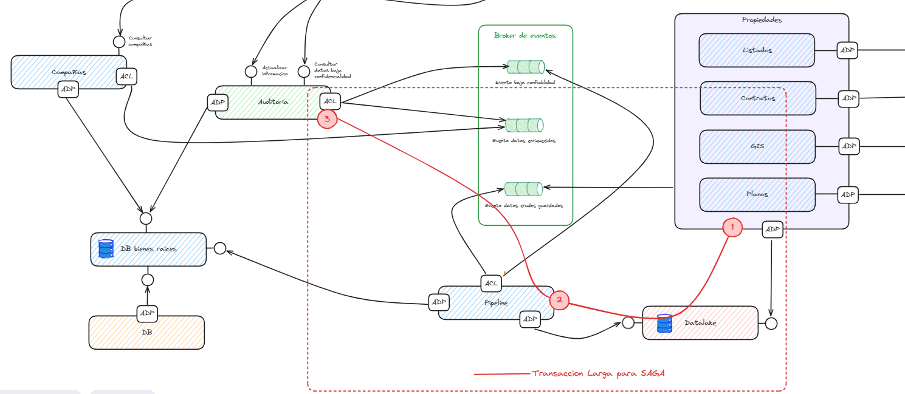

# Entrega 4 - Diseño de la experimentacion y POC de Servicios
GRUPO JUPITER

Repositorio con código base para el uso de un sistema usando el patrón CQRS y usando eventos de dominio 
Estamos simulando 3 atributos de calidad: Escalabilidad, Modificabilidad y Disponibilidad cada uno con un escenario, segun se describe en graficas anexas:


## Estructura del proyecto

Este repositorio sigue la siguiente estructura, hemos incorporado 4 microservicios: 1. Auditoria (enriquecimiento de informacion por auditores), 2. Compañias (son las vistas de los clientes), 3. Pipeline (detecta la completitud de informacion que recoge propiedades), 4. Propiedades (hace la busqueda e ingesta de datos de las propiedades en fuentes externas)

Cada Microservicios tiene la siguiente estructura de carpetas:

- **api**: En este módulo tenemos el API de `enrequecimiento.py` el cual cuenta con dos endpoints: `/audit` y `audit`, los cuales por detrás de escenas usan un patrón CQRS como la base de su comunicación.
- **modules/../enrequecimiento/application**: Este módulo ahora considera los sub-módulos: `queries` y `commands`. En dichos directorios se desacopló las diferentes operaciones lectura y escritura.
- **modules/../enrequecimiento/domain**: 
- **modules/../enrequecimiento/infraestructure**: Este archivo cuenta con toda la lógica en términos de infrastructura para consumir los eventos y comandos
- **modulos/../validacion/application**:  
- **modulos/../validacion/domain**: 
- **seedwork/application/**: 
- **seedwork/domain/**: 
- **seedwork/infraestructure/**: 
- **seedwork/presentation/**: 

## SAGA
Hemos definido como transaccion larga, el flujo que va desde el microservicio Properties que solicita una ingesta de datos externos (se tiene un mock.json)
este escribe los datos en el datalake (diseño datos distribuido), y al mismo tiempo notifica mediante un evento al microservicio pipeline a traves de un broker 
de eventos con Pulsar, en este caso el pipeline hace una validacion binaria de presencia o no de datos y desde alli notifica la exactitud
de los datos al microservicio Auditoria, quien termina escribiendo el enriquecimiento de datos que aplique en otra base de datos donde se tienen 
los datos estructurados, base de datos bienes raices, en este flujo de 3 microservicios definimos la SAGA, de tal forma que escogimos
el microservicio Properties como Orquestador, en caso de que uno de los pasos se corrompa, se ejecutaria un rollback de la transaccion 
en cada microservicio involucrado


## Propiedades de los Alpes
### Ejecutar Aplicación

Desde el directorio principal ejecute el siguiente comando.
Debe tener el daemon de Docker corriendo previamente, y luego ejecuta docker-compose para que suba todo.


```bash
docker-compose build
```

```bash
docker-compose up
```

En el siguiente enlace se encuentra la documentación de los servicios expuestos por el microservicio auditoria:
[Documentacion postman](https://documenter.getpostman.com/view/1827448/2sA2rDy1na)
