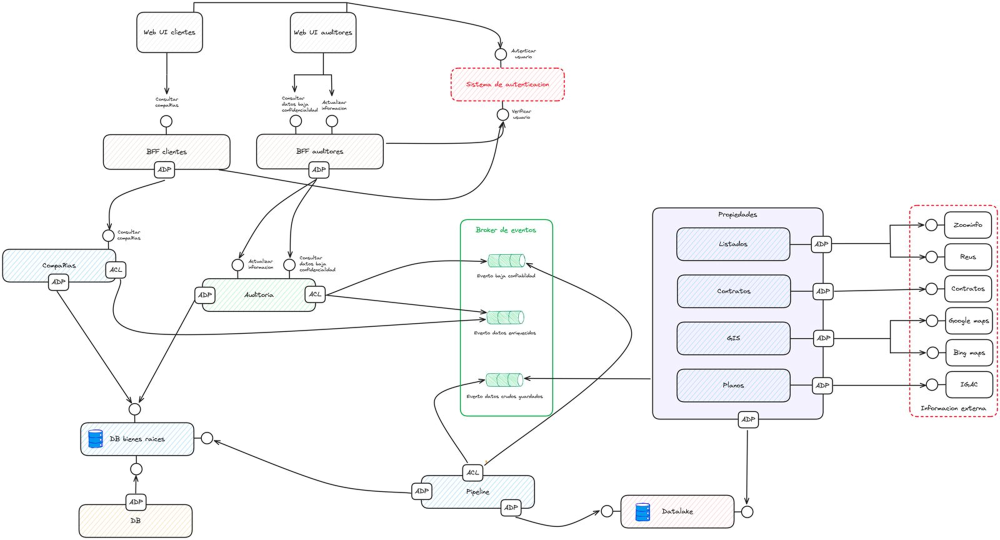

# Entrega 3 - Diseño de la experimentacion y POC de Servicios
GRUPO JUPITER

Repositorio con código base para el uso de un sistema usando el patrón CQRS y usando eventos de dominio 
Estamos simulado un atributo de calidad de escalabilidad con un escenario de actualizacion de caracteristicas, segun se describe en grafica anexa:



## Estructura del proyecto

Este repositorio sigue la siguiente estructura, donde solo estamos trabajando con el microservicio auditoria:


- **api**: En este módulo tenemos el API de `enrequecimiento.py` el cual cuenta con dos endpoints: `/audit` y `audit`, los cuales por detrás de escenas usan un patrón CQRS como la base de su comunicación.
- **modules/../enrequecimiento/application**: Este módulo ahora considera los sub-módulos: `queries` y `commands`. En dichos directorios se desacopló las diferentes operaciones lectura y escritura.
- **modules/../enrequecimiento/domain**: 
- **modules/../enrequecimiento/infraestructure**: Este archivo cuenta con toda la lógica en términos de infrastructura para consumir los eventos y comandos
- **modulos/../validacion/application**:  
- **modulos/../validacion/domain**: 
- **seedwork/application/**: 
- **seedwork/domain/**: 
- **seedwork/infraestructure/**: 
- **seedwork/presentation/**: 

## Propiedades de los Alpes
### Ejecutar Aplicación

Desde el directorio principal ejecute el siguiente comando.
Debe tener el daemon de Docker corriendo previamente, y luego ejecuta docker-compose para que suba todo.


```bash
docker-compose build
```

```bash
docker-compose up
```

